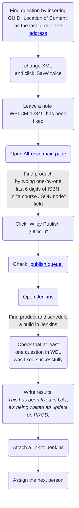

# Workflows for Sybex tickets

## Checking 

*Checking an issue description against online test bank and offline printed book* 

```mermaid
graph TD
    Ticket("Choose a ticket \n<a href='https://jira.wiley.com/browse/WELCM-29476?filter=67750'>List of open\n <b>Sybex</b> tickets</a>") --> |"Copy <b>six digits</b> which follow\nafter ''tb'' (like tb012345)"| SpreadSheet("<a href='https://wiley.sharepoint.com/:x:/r/teams/ReprintDocuments/_layouts/15/guestaccess.aspx?wdLOR=c91F00341-4041-9042-9857-DA8734875602&share=ERUV8UaGHgFJkVfPr9xtEEsBu2JC2_4kJIalHtErZPLcMA'>Find ISBN with this ending\nin Sybex_TB_SMEs.xslx"</a>)
    
    SpreadSheet --> |Copy the course name\nin the column <b>лю</b>| WEL("Find this course in <a href='https://uat3app.efficientlearning.com/my-account/rest/masquerade/login?u=adde93aa-59ba-4b15-b84e-ebe12b8515a4'>WEL test bank</a>")
    
    WEL--> |Copy full Question ID from Jira\nand find question in WEL| WELQuestion("Open question,\nclick correct answer,\nsnap a screenshot")
    
    WELQuestion --> FindInBook("Find this question\nin book in <a href='https://thevault.wiley.com/loadPublicationView.htm?cartId=00d503d1-2fdf-4c5f-aa58-72e1368c3e3f&cartName=Default'>Vault BPA</a>\n(hint: add a book to MyCart)")
    
    FindInBook --> IsQInBook{"Is there a question\nin a book?"} --> |Yes| BookScrn("Snap a screenshot of question\nin book") --> AnswerScrn("Snap a screensshoot\nof answer and explanation\nin book's backmatter\n(e.g. b01)")
    
    Summary --> SMENeededQ{"Is SME Needed?"} --> |Yes| WriteEmail("Write an email\nto <a href='https://wiley.sharepoint.com/:x:/r/teams/ReprintDocuments/_layouts/15/guestaccess.aspx?wdLOR=c91F00341-4041-9042-9857-DA8734875602&share=ERUV8UaGHgFJkVfPr9xtEEsBu2JC2_4kJIalHtErZPLcMA'>SME</a>")
    
    WriteEmail --> WaitSME("Wait answer from SME")
    
    IsQInBook{"Is there a question\nin a book?"} --> |No| AddScreenshotsInJira("Attach screenshots\nin Jira ticket")
    
    AddScreenshotsInJira --> Summary("Write summary:<i>\nISBN: xxx\nChapter ., Question ..\n TB and book do/don't match\nIssue description: ...\nChange proposal: ...\n and/or SME review is needed</i>")
    
    AnswerScrn --> AddScreenshotsInJira

    SMENeededQ --> |No| NextStep("You are ready\nto do edits.")

    WaitSME --> NextStep
```

## Editing XML

*Editing and pre-publishing.*

```mermaid
graph TD
    QInAlfreco("Find question by inserting\nGUID ''Location of Content''\n as the last term of the <a href='http://ec2-34-233-201-87.compute-1.amazonaws.com:9090/share/page/site//document-details?nodeRef=workspace://SpacesStore/06cd5372-fca5-42d4-a9ff-6abea34d5b81'>address</a>") -->  inlineEdit("change XML \nand click 'Save' twice")
    
    inlineEdit --> note("Leave a note \n'WELCM-12345' has been fixed")
    
    note --> Alfresco("Open <a href='http://ec2-34-233-201-87.compute-1.amazonaws.com:9090/share/page/documentlibrary#filter=path%7C%2FWiley%20Content%2FProducts'>Alfresco main page</a>")
    
    Alfresco --> |Find product \nby typing one-by-one\nlast 6 digits of ISBN \n in ''a course JSON node'' field| publish("Click ''Wiley Publish (Offline)''")
    
    publish --> checkQueue("Check <a href='http://ec2-34-233-201-87.compute-1.amazonaws.com:9090/share/page/queue-publish'>''publish queue''</a>")
    
    checkQueue -->Jenkins("Open <a href='http://ci.efficientlearning.com'>Jenkins</a>")
    
    
    Jenkins --> |Find product and schedule\na build in Jenkins| CheckWEL("Check that at least \none question in WEL\nwas fixed successfully")
    
    CheckWEL --> Comment("Write results:\n<i>This has been fixed in UAT;\n it's being waited an update on PROD.</i>")
    
    Comment --> JenkinsLink("Attach a link to Jenkins")
    
    JenkinsLink --> Assign("Assign the next person")
```
